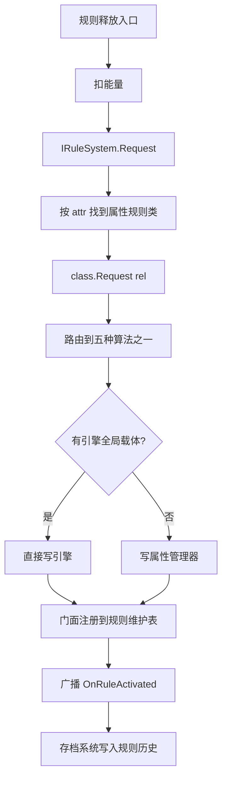
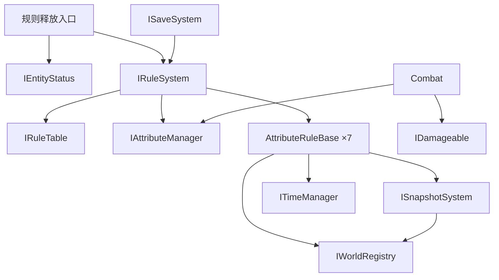

# 《规则游戏》接口与事件定义

> **依据**：[系统模块架构.md](系统模块架构.md)
> **版本**：v2.0 · 2026-10-04
> **用途**：**接口冻结文档**。定死后各模块可并行开发。

---

## 一、通用约定

### 1.1 枚举

```csharp
// 7 个属性（已砍掉空间、方向）
public enum AttributeId {
    Gravity,    // 重力
    Time,       // 时间
    Friction,   // 摩擦
    Mass,       // 质量
    Relation,   // 关系
    Damage,     // 伤害/生命
    Causality,  // 因果
}

// 5 种关系（已砍掉循环）
public enum RelationId {
    Revert,     // 反转
    Nullify,    // 失效
    Constant,   // 恒定
    Enhance,    // 增强
    Weaken,     // 削弱
}

// 规则来源（仅用于视觉提示，不参与优先级）
public enum RuleSource { Player, Enemy, LevelScript }

// 时间来源（用枚举，不用字符串）
public enum TimeSource { Rule, UI }
```

> ⚠️ **`RuleSource` 绝不参与优先级判断** —— 单一规则表是「后写覆盖先写」（决策 D6）。

### 1.2 事件的使用方式

**使用 C# 原生 `event`，挂在各系统接口上。不设全局事件总线。**

| 做法 | 说明 |
|---|---|
| 事件定义在**拥有该概念的系统接口**上 | 如 `IRuleSystem.OnRuleActivated`、`ITimeManager.OnPausedChanged` |
| 订阅者通过系统引用订阅 | 系统是单例 / 管理器，可取到引用 |
| 跨系统协作走对方的公开方法 | 如场景调用 `ILevelFlow.NotifyGoalReached()` |

**为什么不用全局事件总线**：

- C# 原生 `event` 已经够用，全局总线是多余的一层间接
- 全局静态总线隐藏依赖关系，且难以单独测试
- 事件挂在接口上，**编译器能检查类型**，订阅关系一目了然

### 1.3 规则定义（数据）

`RuleDef` 是**规则系统内部的数据**，**不出现在对外接口签名里**（外部一律用枚举）。

```csharp
[CreateAssetMenu(menuName = "规则游戏/RuleDef")]
public class RuleDef : ScriptableObject {
    public AttributeId Attribute;
    public RelationId  Relation;
    public float Duration;          // <= 0 表示关卡内永久
    public float ActivationCost;    // 生效消耗（所有规则都有）
    public string DisplayName;
    [TextArea] public string Description;
}
```

---

## 二、规则系统

### 2.1 规则维护表

**7 个固定槽位，每属性一个。** 同时是**规则剩余时间的唯一持有者**。

```csharp
public struct ActiveRule {
    public RelationId Relation;
    public float      Remaining;   // 剩余时间；<0 表示永久
    public RuleSource Source;      // 仅用于表现层
}

public interface IRuleTable {
    bool        IsActive(AttributeId attr);
    bool        IsActive(AttributeId attr, RelationId rel);
    ActiveRule? GetSlot(AttributeId attr);
    IReadOnlyDictionary<AttributeId, ActiveRule> Slots { get; }
}
```

> **剩余时间放在表里，不放在属性规则类里** —— 避免同一份状态两处维护（与 `TimeMechanicsEnabled` 同一类问题）。
> 规则系统统一 Tick 所有槽位，到期后调用对应属性类的 `Clear()`。

### 2.2 属性管理器

**外部事实来源。** 只保存「没有引擎全局载体」的属性值（决策 D13）。

```csharp
public struct AttributeValues {
    // 1.0 = 正常值
    public float FrictionScale;
    public float MassScale;
    public float DamageScale;

    // 伤害/生命类开关
    public bool  DamageInverted;    // 攻防反转
    public bool  DamageDisabled;    // 伤害失效

    // 关系 / 因果：待实现时扩展
}

public interface IAttributeManager {
    AttributeValues Values { get; }

    void SetFrictionScale(float v);
    void SetMassScale(float v);
    void SetDamageScale(float v);
    void SetDamageInverted(bool v);
    void SetDamageDisabled(bool v);

    void ResetToDefault();   // 重开关卡 / 规则全清
}
```

> ✅ **`TimeMechanicsEnabled` 已从此处移除**，改由时间管理器唯一维护（见 3.1）。
> **重力与时间速率也不在这里** —— 直接写 `Physics2D.gravity` 与 `Time.timeScale`。

### 2.3 属性规则类基类

**7 个属性各实现一个。基类直接声明五种关系算法。**

```csharp
public abstract class AttributeRuleBase {
    // ---- 五种关系算法（子类实现）----
    protected abstract void OnRevert();
    protected abstract void OnNullify();
    protected abstract void OnConstant();
    protected abstract void OnEnhance();
    protected abstract void OnWeaken();

    // ---- 统一入口：路由到对应算法 ----
    public void Request(RelationId rel) {
        switch (rel) {
            case RelationId.Revert:   OnRevert();   break;
            case RelationId.Nullify:  OnNullify();  break;
            case RelationId.Constant: OnConstant(); break;
            case RelationId.Enhance:  OnEnhance();  break;
            case RelationId.Weaken:   OnWeaken();   break;
        }
    }

    // ---- 行为型规则覆写（时间恒定 / 时间反转）----
    public virtual void Tick(float deltaTime) { }

    // ---- 规则到期 / 被覆盖 / 重开关卡 ----
    public virtual void Clear() { }
}
```

**设计说明**：

| 点 | 说明 |
|---|---|
| **不设 `AttributeId` 属性** | 类名本身就是属性的标识，无需再存一份 |
| **不接收 `RuleDef`** | 只接收关系枚举；规则参数由属性类自己的配置提供 |
| **五种算法直接声明** | 编译期即可检查，不用通用分派表 |
| **未定义的关系** | 留空实现（如「摩擦 + 反转」在规则矩阵里仍未定稿） |
| **计时不在基类** | 剩余时间由规则维护表持有，规则系统统一 Tick |
### 2.4 规则系统门面

```csharp
public interface IRuleSystem {
    IRuleTable        Table      { get; }
    IAttributeManager Attributes { get; }

    // ---- 写入入口（外部一律用枚举，不传 RuleDef）----
    // 内部：按 attr 找到属性规则类 → 调用 class.Request(rel)
    //       → 向规则维护表注册（含 rel / 剩余时间 / source）
    void Request(AttributeId attr, RelationId rel, RuleSource source);

    // ---- 费用查询（供规则释放入口扣除能量）----
    float GetActivationCost(AttributeId attr, RelationId rel);

    // ---- 重开关卡 ----
    void ClearAll();

    // ---- 存档 ----
    List<string> ExportActiveIds();

    // ---- 事件 ----
    event Action<AttributeId, RelationId, RuleSource> OnRuleActivated;
    event Action<AttributeId>                         OnRuleExpired;
    event Action                                      OnRulesChanged;
}
```

> ⚠️ **`IRuleSystem` 不认识能量、不认识玩家/敌人**（约束 C4）。
> 能量检查与扣除在**规则释放入口**完成（见 4.3）。

### 2.5 规则生效流程



**关于写入存档历史**：存档系统**订阅** `OnRuleActivated` 事件，把记录写入规则历史模块。
规则系统不需要认识存档系统。

---

## 三、基础设施

### 3.1 时间管理器

**时间机制开关的唯一持有者。**

```csharp
public interface ITimeManager {
    // ---- 查询 ----
    float TimeScale { get; }               // 合成后的最终倍率
    bool  IsPaused  { get; }
    bool  TimeMechanicsEnabled { get; }    // 供冷却 / Buff / Debuff 读取（唯一来源）

    // ---- 时间来源（乘法合成，枚举标识）----
    void PushScale(TimeSource source, float scale);
    void RemoveScale(TimeSource source);

    // ---- 暂停 ----
    void SetPaused(bool paused);

    // ---- 事件 ----
    event Action<float> OnTimeScaleChanged;
    event Action<bool>  OnPausedChanged;
    event Action<bool>  OnTimeMechanicsChanged;
}
```

**使用示例**：

| 场景 | 调用 |
|---|---|
| 拼装界面打开 | `SetPaused(true)` |
| 时间削弱规则生效 | `PushScale(TimeSource.Rule, 0.5f)` |
| 时间失效规则生效 | 设置 `TimeMechanicsEnabled = false`，**不改 TimeScale** |
| 规则到期 | `RemoveScale(TimeSource.Rule)` |

> **时间管理器只负责速率与开关。** 恒定 / 反转的行为逻辑在规则系统里。

### 3.2 快照系统

#### 快照数据结构

```csharp
public class Snapshot {
    public float CapturedAt;                    // 采集时刻
    public List<EntityState> Entities;          // 所有动态实体
    public ActiveRule?[] RuleSlots;             // 7 个属性槽位
    public AttributeValues Attributes;          // 属性管理器值
    public List<ObjectActiveState> ObjectStates;// 对象启用/禁用情况
}

// 单个动态实体的状态
public struct EntityState {
    public IRuleAffected Entity;
    public Vector2 Position;
    public Vector2 Velocity;
    public float   Rotation;
    public int     AnimatorStateHash;           // 动画状态
    public float   AnimatorNormalizedTime;      // 动画归一化时间
    public EntityStatusData Status;             // 实体状态组件（能量 / 生命等）
}

// 对象的启用/禁用情况（决策 D15：禁用而非销毁）
public struct ObjectActiveState {
    public GameObject GameObject;
    public bool       ActiveSelf;
}
```

> **不记录**：粒子、特效。恢复时直接重启，视觉上无感。

#### 接口

```csharp
public interface ISnapshotSystem {
    // ---- 单点快照（时间恒定 / 重开关卡）----
    Snapshot Capture();
    void     Restore(Snapshot snap);

    // ---- 环形缓冲（时间反转）----
    int  CaptureToBuffer();                    // 返回索引
    bool TryPeekSecondLast(out Snapshot snap); // 只读倒数第二张
    void DiscardNewerThan(int index);          // 回溯后丢弃更新的快照
    void ClearBuffer();

    event Action OnRestored;
}
```

> 🔴 **对象一律「禁用」而非销毁**（决策 D15）—— 这是 `ObjectActiveState` 能恢复的前提。
### 3.3 关卡流程

```csharp
public interface ILevelFlow {
    int CurrentLevel { get; }
    IReadOnlyList<int> ClearedLevels { get; }

    // ---- 请求（内部走事件，不直接调用场景 / 存档）----
    void RequestRestart();
    void RequestNextLevel();
    void NotifyGoalReached();

    // ---- 事件 ----
    event Action<int> OnLevelStart;
    event Action<int> OnLevelComplete;
    event Action<int> OnLevelFailed;
    event Action<int> OnRestartRequested;
}
```

> **约束**：不直接调用场景系统、不直接调用存档系统。所有跨系统协作走事件。

### 3.4 对象注册表

```csharp
// 所有受规则影响的动态实体都实现它
public interface IRuleAffected {
    Rigidbody2D  Body      { get; }
    Collider2D[] Colliders { get; }
}

public interface IWorldRegistry {
    void Register(IRuleAffected entity);
    void Unregister(IRuleAffected entity);
    IReadOnlyList<IRuleAffected> All { get; }
}
```

**用途**：摩擦 / 质量遍历（改碰撞体材质与刚体质量）、快照采集。

> ⚠️ **不要每帧 `FindObjectsOfType`** —— 注册表就是为替代它而存在的。

---

## 四、实体与玩法

### 4.1 实体状态组件

**一个接口覆盖整个状态组件**（能量、生命、手持物、投掷物数量等）。

```csharp
public interface IEntityStatus {
    // ---- 能量 ----
    float Energy    { get; }
    float EnergyMax { get; }

    // ---- 生命 ----
    float Health    { get; }
    float HealthMax { get; }

    // ---- 持有物 ----
    object HeldItem       { get; }
    int    ThrowableCount { get; }

    // ---- 事件 ----
    event Action<float, float> OnEnergyChanged;   // (current, max)
    event Action<float, float> OnHealthChanged;
    event Action<int> OnThroableCoutChanged;
    event Action<string> OnHeldItemChanged;
}
```

**归属**：**玩家**与**敌人**各挂一个（决策 D8）。两者行为可不同，接口一致。

### 4.2 伤害

#### 伤害结构体

```csharp
public struct DamageInfo {
    public object Attacker;   // 施加方
    public object Target;     // 承受方
    public float  Amount;     // 伤害数值
    public float  Knockback;  // 击退数值
}
```

#### 承受方接口

```csharp
public interface IDamageable {
    void ApplyDamage(in DamageInfo damage);
}
```

> **不暴露抗性值** —— 抗性逻辑写在各自的 `ApplyDamage` 实现内部。
> 这样规则系统不需要知道任何实体的抗性（约束 C4）。

#### 攻击流程


| 步骤 | 说明 |
|---|---|
| 1. 构造攻击碰撞体 | 施加方在攻击时生成判定区域 |
| 2. 获得承受方 | 检测与该碰撞体相交的实体 |
| 3. 构造 `DamageInfo` | **伤害数值由施加方计算**（基础值 × 属性管理器的伤害缩放） |
| 4. 传给承受方 | 调用 `IDamageable.ApplyDamage` |
| 5. 承受方应用 | 内部处理自身抗性、扣血、击退、死亡 |

### 4.3 规则释放入口

**能量检查与扣除在这里完成**（决策 D9）。

```csharp
public interface IRuleRelease {
    // 完整流程：
    //   1. 查费用 IRuleSystem.GetActivationCost(attr, rel)
    //   2. TryConsumeEnergy —— 不足则返回 false
    //   3. 调用 IRuleSystem.Request(attr, rel, RuleSource.Player)
    bool TryRelease(AttributeId attr, RelationId rel);
}
```

**位置**：挂在**玩家控制器 / 拼装界面**上。

**为什么不放在规则系统里**：

```
玩家移动要读属性管理器  →  玩家依赖规则系统
若规则系统再依赖玩家能量  →  循环依赖
```

### 4.4 存档

```csharp
[Serializable]
public class EntityStatusData {
    public float  Energy;
    public float  Health;
    public string HeldItem;
    public int    ThrowableCount;
}

[Serializable]
public class RuleEventRecord {
    public string RuleId;      // "gravity.revert"
    public int    LevelIndex;
    public float  Time;
}

[Serializable]
public class SaveData {
    public List<string> UnlockedAttributes;
    public List<string> UnlockedRelations;
    public List<string> ActiveRuleIds;          // 跨关卡已激活规则
    public List<RuleEventRecord> History;       // 激活历史，供 NPC 台词
    public int   CurrentLevel;
    public List<int> ClearedLevels;
    public EntityStatusData PlayerStatus;       // ← 替代单一 Energy 字段
}

public interface ISaveSystem {
    SaveData Capture();
    void     Apply(SaveData data);
    void     Save();
    SaveData Load();
}
```

> 🔴 **绝不序列化任何 Transform / Rigidbody / 物理状态**（约束 C5）。
> `EntityStatusData` 同时用于**快照**（见 3.2 `EntityState.Status`）。
---

## 五、事件清单

### 5.1 事件归属

**事件定义在拥有该概念的系统接口上。**

| 所属接口 | 事件 | 订阅者 |
|---|---|---|
| `IRuleSystem` | `OnRuleActivated(attr, rel, source)` | HUD · VFX · NPC 台词 · **存档（写历史）** |
| | `OnRuleExpired(attr)` | HUD · 属性规则类（清理） |
| | `OnRulesChanged` | HUD（刷新生效规则列表） |
| `ITimeManager` | `OnTimeScaleChanged(scale)` | VFX · 音频 |
| | `OnPausedChanged(paused)` | 敌人 AI · 玩家控制 · UI |
| | `OnTimeMechanicsChanged(enabled)` | 冷却 / Buff 系统 |
| `ISnapshotSystem` | `OnRestored` | 表现层（画面反馈） |
| `ILevelFlow` | `OnLevelStart(level)` | 场景系统 · 存档 · UI |
| | `OnLevelComplete(level)` | 存档 · UI（结算） |
| | `OnLevelFailed(level)` | UI |
| | `OnRestartRequested(level)` | 场景系统 · 快照系统 |
| `IEntityStatus` | `OnEnergyChanged(cur, max)` | HUD |
| | `OnHealthChanged(cur, max)` | HUD · VFX |
| `ICombatSystem` | `OnDamageApplied(damageInfo)` | VFX · 音频 · UI |
| | `OnEntityDied(entity)` | 状态组件（击杀回能） · 关卡流程 |
| `ISceneSystem` | `OnSceneLoadStarted(level)` | UI（过场） |
| | `OnSceneLoadFinished(level)` | 存档 · UI |
| `IPlayerInput` | `OnRewindRequested(source)` | 时间恒定规则类 · 时间反转规则类 |
| `IAssembleUI` | `OnAssembleOpened` / `OnAssembleClosed` | 时间管理器（暂停） |

### 5.2 补充接口（事件宿主）

```csharp
public interface ICombatSystem {
    event Action<DamageInfo> OnDamageApplied;
    event Action<object>     OnEntityDied;
}

public interface ISceneSystem {
    void LoadLevel(int level);
    event Action<int> OnSceneLoadStarted;
    event Action<int> OnSceneLoadFinished;
}

public interface IPlayerInput {
    event Action<RewindSource> OnRewindRequested;
}

public enum RewindSource { DedicatedKey, ReleaseChannel }

public interface IAssembleUI {
    event Action OnAssembleOpened;
    event Action OnAssembleClosed;
}
```

> **回溯输入**：时间恒定监听 `DedicatedKey`，时间反转监听 `ReleaseChannel`（决策 D16）。

---

## 六、依赖速查



**四条关键约束**：

| 约束 | 说明 |
|---|---|
| `IRuleSystem` 不认识能量 | 能量在规则释放入口处理 |
| `IRuleSystem` 不认识玩家 / 敌人 | 抗性写在各自的 `ApplyDamage` 实现里 |
| `ITimeManager` 不管恒定 / 反转 | 只负责速率与时间机制开关 |
| `ILevelFlow` 不直接调场景 / 存档 | 走事件 |

---

## 七、接口冻结顺序

| 顺序 | 接口 | 冻结后谁可以开工 |
|---|---|---|
| 1 | `IRuleTable` + `IAttributeManager` + 枚举 | **7 个属性规则类的开发者** |
| 2 | `AttributeRuleBase` | 同上 |
| 3 | `ITimeManager` | 所有写移动 / AI 的人 |
| 4 | `ISnapshotSystem` + `Snapshot` | 恒定、反转、重开关卡三方 |
| 5 | `IEntityStatus` + `DamageInfo` + `IDamageable` | 玩家 / 敌人 / 战斗 |
| 6 | `IRuleSystem` + `IRuleRelease` | UI / 存档 |

---

## 八、v2.0 修正记录

对照你提出的问题，逐条确认：

| # | 你的意见 | 处理 |
|---|---|---|
| 1 | C# 有自己的事件系统，为什么还要事件总线 | ✅ **删除全局事件总线**，改用 C# 原生 `event` 挂在系统接口上 |
| 2 | 属性规则基类的 `AttributeId` 有什么用 | ✅ **删除**。类名即标识，路由由门面按 attr 查表完成 |
| 3 | 抽象类直接定义五种算法 | ✅ 基类声明 `OnRevert/OnNullify/OnConstant/OnEnhance/OnWeaken` 五个抽象方法 |
| 4 | 门面 `Request` 不该传 `RuleDef`，应用枚举 | ✅ 改为 `Request(AttributeId, RelationId, RuleSource)` |
| 5 | 属性规则类的 `Request` 只接收关系枚举 | ✅ 改为 `Request(RelationId rel)` |
| 6 | 规则生效后应写入存档的历史规则模块 | ✅ 存档系统订阅 `OnRuleActivated` 写入历史 |
| 7 | `TimeMechanicsEnabled` 两处维护，违反单一事实来源 | ✅ **只保留在时间管理器**，从 `AttributeValues` 移除 |
| 8 | 时间来源改用枚举 | ✅ 新增 `TimeSource { Rule, UI }`，替换字符串 |
| 9 | `Snapshot` 没定义 | ✅ 补充 `Snapshot` / `EntityState` / `ObjectActiveState` 定义 |
| 10 | 先定义伤害结构体；`IDamageable` 不需要抗性 | ✅ 新增 `DamageInfo`（施加方/承受方/伤害/击退）；`IDamageable` 只有 `ApplyDamage`；补充攻击流程 |
| 11 | 能量不该是接口，改成状态组件接口 | ✅ 改为 `IEntityStatus`（能量/生命/手持物/投掷物数量） |
| 12 | 存档的 `Energy` 改成存状态组件 | ✅ 改为 `EntityStatusData` |

---

## 附录 · 相关文档

| 文档 | 内容 |
|---|---|
| [系统模块架构.md](系统模块架构.md) | 系统与模块分解（本文的上层） |
| [规则游戏_策划案_v3.md](规则游戏_策划案_v3.md) | 正式策划案 |
| [规则矩阵.json](规则矩阵.json) | 35 个规则格位 |

*本文为接口冻结文档 v2.0。*