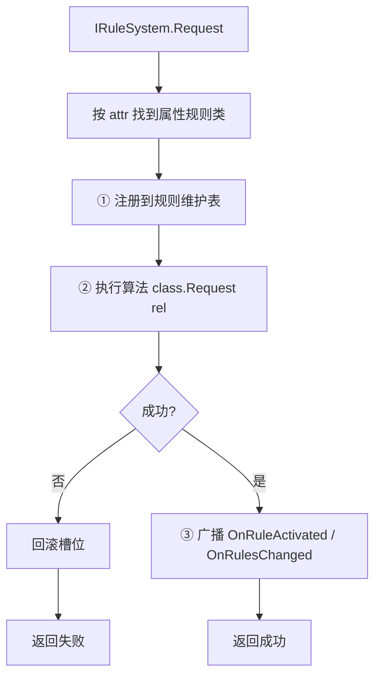
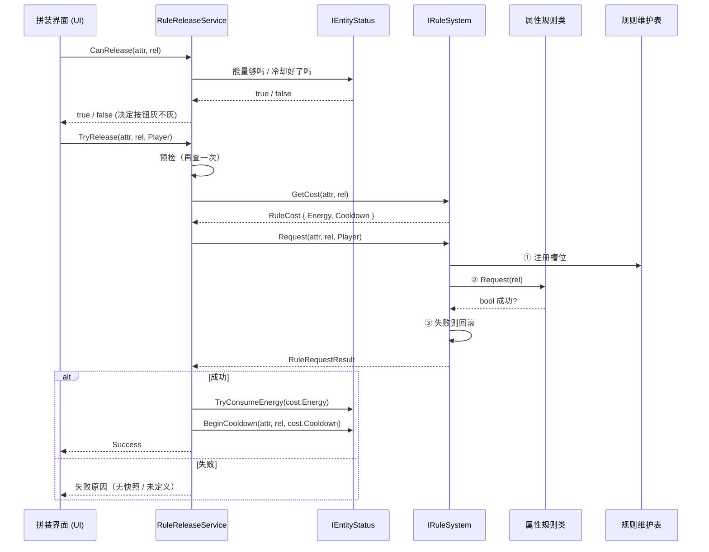
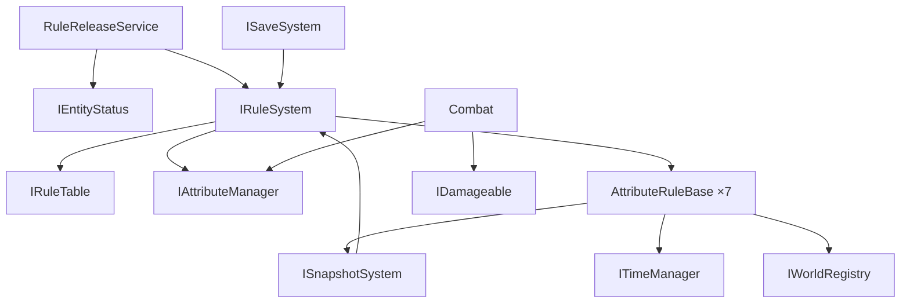

# 《规则游戏》接口与事件定义

> **依据**：[系统模块架构.md](系统模块架构.md) · 修订方案见 [本地文档/接口修订方案.md](../本地文档/接口修订方案.md)
> **版本**：v3.0 · 2026-10-07
> **用途**：**接口冻结文档**。定死后各模块可并行开发。

---

## 一、通用约定

### 1.1 枚举

> 📁 **位置：`Infrastructure/Shared/Rules/`**（不是 `Core/`）
> 原因见 1.4 与 3.2：快照系统需要读规则表，词汇必须在快照系统能看到的地方。

```csharp
public enum AttributeId {
    Gravity,    // 重力
    Time,       // 时间
    Friction,   // 摩擦
    Mass,       // 质量
    Relation,   // 关系
    Damage,     // 伤害/生命
    Causality,  // 因果
}

public enum RelationId {
    Revert,     // 反转
    Nullify,    // 失效
    Constant,   // 恒定
    Enhance,    // 增强
    Weaken,     // 削弱
}

public enum RuleSource { Player, Enemy, LevelScript }

public enum TimeSource { Rule, UI }
```

> ⚠️ **`RuleSource` 绝不参与优先级判断** —— 单一规则表是「后写覆盖先写」。

### 1.2 事件的使用方式

**使用 C# 原生 `event`，挂在各系统接口上。不设全局事件总线。**

| 做法 | 说明 |
|---|---|
| 事件定义在**拥有该概念的系统接口**上 | 如 `IRuleSystem.OnRuleActivated`、`ITimeManager.OnPausedChanged` |
| 订阅者通过系统引用订阅 | 系统是单例 / 管理器，可取到引用 |
| 跨系统协作走对方的公开方法 | 如场景调用 `ILevelFlow.NotifyGoalReached()` |

**为什么不用全局事件总线**：

- C# 原生 `event` 已经够用，全局总线是多余的一层间接
- 全局静态总线隐藏依赖关系，且难以单独测试
- 事件挂在接口上，**编译器能检查类型**，订阅关系一目了然

### 1.3 规则定义（数据）

`RuleDef` 是**规则系统内部的数据**，**不出现在对外接口签名里**（外部一律用枚举）。

```csharp
[CreateAssetMenu(menuName = "规则游戏/RuleDef")]
public class RuleDef : ScriptableObject {
    public AttributeId Attribute;
    public RelationId  Relation;
    public float Duration;          // <= 0 表示关卡内永久
    public float ActivationCost;    // 唯一的费用字段
    public float Cooldown;          // 冷却秒数，0 = 无冷却
    public string DisplayName;
    [TextArea] public string Description;
}
```

> **只有 `ActivationCost`，没有 `PerUseCost`。**
> 因为反转的「激活」就是「回退」本身，不存在独立的每次使用费。

### 1.4 目录与程序集归属（新增）

**接口层与实现层分离**：

| 内容 | 位置 | 程序集 |
|---|---|---|
| 枚举（1.1） | `Infrastructure/Shared/Rules/` | `RuleGame.Infrastructure` |
| `ActiveRule` / `IRuleTable` | 同上 | 同上 |
| `AttributeValues` / `IAttributeManager` | 同上 | 同上 |
| `IRuleSystem`（接口） | 同上 | 同上 |
| `EntityStatusData` | `Infrastructure/Shared/` | 同上 |
| `RuleTable` / `AttributeManager` / `RuleSystem` | `Core/Rules/` | `RuleGame.Core` |
| `AttributeRuleBase` + 7 个属性规则类 | `Core/Rules/AttributeRules/` | 同上 |
| `RuleDef` / `IRuleCatalog` | `Core/Rules/Data/` | 同上 |

**依赖方向**：

```
Infrastructure/Shared/Rules/   ← 接口 + 词汇（零依赖）
        ↑
Core/Rules/                    ← 实现
```

> **代价（明确接受）**：`Infrastructure` 里出现了带规则语义的接口。这不是纯净的分层，
> 但快照系统需要直接读写规则表，为此写一套事件 + payload 机制不值得。

---

## 二、规则系统

### 2.1 规则维护表

**7 个固定槽位，每属性一个。** 同时是**规则剩余时间的唯一持有者**。

```csharp
public struct ActiveRule {
    public RelationId Relation;
    public float      Remaining;   // 剩余时间；<0 表示永久
    public RuleSource Source;      // 仅用于表现层
}

public interface IRuleTable {
    bool        IsActive(AttributeId attr);
    bool        IsActive(AttributeId attr, RelationId rel);
    ActiveRule? GetSlot(AttributeId attr);
    IReadOnlyDictionary<AttributeId, ActiveRule> Slots { get; }

    // ---- 供快照系统直接读写 ----
    ActiveRule?[] SnapshotSlots();
    void          RestoreSlots(ActiveRule?[] slots);
}
```

> **剩余时间放在表里，不放在属性规则类里** —— 避免同一份状态两处维护。
> 规则系统统一 Tick 所有槽位，到期后调用对应属性类的 `Clear()`。

### 2.2 属性管理器

**外部事实来源。** 只保存「没有引擎全局载体」的属性值。

```csharp
public struct AttributeValues {
    public float FrictionScale;    // 1.0 = 正常
    public float MassScale;
    public float DamageScale;
    public bool  DamageInverted;   // 攻防反转
    public bool  DamageDisabled;   // 伤害失效
}

public interface IAttributeManager {
    AttributeValues Values { get; }

    void SetFrictionScale(float v);
    void SetMassScale(float v);
    void SetDamageScale(float v);
    void SetDamageInverted(bool v);
    void SetDamageDisabled(bool v);

    void ResetToDefault();

    // ---- 供快照系统直接读写 ----
    void RestoreValues(AttributeValues values);
}
```

> **重力与时间速率不在这里** —— 它们直接写 `Physics2D.gravity` 和 `Time.timeScale`。

### 2.3 属性规则类基类

**7 个属性各实现一个。基类直接声明五种关系算法。**

```csharp
public abstract class AttributeRuleBase {
    // ---- 五种关系算法（子类实现，未定义的返回 false）----
    protected abstract bool OnRevert();
    protected abstract bool OnNullify();
    protected abstract bool OnConstant();
    protected abstract bool OnEnhance();
    protected abstract bool OnWeaken();

    // ---- 统一入口 ----
    public RuleRequestResult Request(RelationId rel) {
        bool ok = rel switch {
            RelationId.Revert   => OnRevert(),
            RelationId.Nullify  => OnNullify(),
            RelationId.Constant => OnConstant(),
            RelationId.Enhance  => OnEnhance(),
            RelationId.Weaken   => OnWeaken(),
            _ => false,
        };
        return ok
            ? RuleRequestResult.Ok()
            : RuleRequestResult.Fail(RuleRequestStatus.NoResource);
    }

    public virtual void Tick(float deltaTime) { }   // 行为型规则覆写
    public virtual void Clear() { }                 // 到期 / 被覆盖 / 重开关卡
}
```

**设计说明**：

| 点 | 说明 |
|---|---|
| **不设 `AttributeId` 属性** | 类名本身就是属性的标识 |
| **不接收 `RuleDef`** | 只接收关系枚举；规则参数由 `IRuleCatalog` 提供 |
| **五算法返回 `bool`** | 只有属性类知道自己是否成功（如「没有可用快照」） |
| **未定义的关系返回 `false`** | 对应 `RuleRequestStatus.Undefined` |
| **计时不在基类** | 剩余时间由规则维护表持有 |
### 2.4 规则系统门面

```csharp
public interface IRuleSystem {
    IRuleTable        Table      { get; }
    IAttributeManager Attributes { get; }

    // ---- 写入入口（外部一律用枚举，不传 RuleDef）----
    RuleRequestResult Request(AttributeId attr, RelationId rel, RuleSource source);

    // ---- 费用查询 ----
    RuleCost GetCost(AttributeId attr, RelationId rel);

    // ---- 重开关卡 ----
    void ClearAll();

    // ---- 存档 ----
    List<string> ExportActiveIds();

    // ---- 事件 ----
    event Action<AttributeId, RelationId, RuleSource> OnRuleActivated;
    event Action<AttributeId>                         OnRuleExpired;
    event Action                                      OnRulesChanged;
}
```

> ⚠️ **`IRuleSystem` 不认识能量、不认识冷却**（约束 C4）。
> 能量与冷却的检查、扣除在**规则判定中枢**完成（见 4.3）。

### 2.5 规则生效流程

**顺序是：注册 → 执行 → 广播。**



**为什么注册在执行之前**：

| 理由 | 说明 |
|---|---|
| 执行期间读表一致 | 算法内部若查询规则表，读到的已经是新状态 |
| 快照恢复可重入 | 时间规则的执行会触发快照操作，此时表已一致 |
| 失败可回滚 | 执行失败时清掉槽位即可，不会留下半个状态 |

**为什么广播在最后**：订阅者（HUD、存档）收到事件后会去查规则表。
如果事件先发、状态没写完，订阅者会读到旧值——这是最难查的一类 bug。

**规则**：**先写状态，再广播。** 永远不要反过来。

**失败回滚**：

```csharp
public RuleRequestResult Request(AttributeId attr, RelationId rel, RuleSource source) {
    var cls = _rules[attr];
    var def = _catalog.Get(attr, rel);

    // ① 注册（先写状态）
    _table.Set(attr, rel, def.Duration, source);

    // ② 执行
    var result = cls.Request(rel);

    // ③ 失败回滚
    if (!result.Succeeded) { _table.Clear(attr); return result; }

    // ④ 广播
    OnRuleActivated?.Invoke(attr, rel, source);
    OnRulesChanged?.Invoke();
    return result;
}
```

### 2.6 费用与结果（新增）

```csharp
public readonly struct RuleCost {
    public float Energy;      // 能量消耗
    public float Cooldown;    // 冷却秒数，0 = 无冷却
}

public enum RuleRequestStatus {
    Success,
    Undefined,     // 该 属性×关系 未定义（规则矩阵里的空格）
    NoResource,    // 行为型规则缺资源，如「没有可用快照」
}

public readonly struct RuleRequestResult {
    public readonly RuleRequestStatus Status;
    public bool Succeeded => Status == RuleRequestStatus.Success;
    public static RuleRequestResult Ok()  => new(RuleRequestStatus.Success);
    public static RuleRequestResult Fail(RuleRequestStatus s) => new(s);
}
```

---

## 三、基础设施

### 3.1 时间管理器

**时间机制开关的唯一持有者。**

```csharp
public interface ITimeManager {
    // ---- 查询 ----
    float TimeScale { get; }               // 合成后的最终倍率
    bool  IsPaused  { get; }
    bool  TimeMechanicsEnabled { get; }    // 供冷却 / Buff / Debuff 读取（唯一来源）

    // ---- 时间来源（乘法合成，枚举标识）----
    void PushScale(TimeSource source, float scale);
    void RemoveScale(TimeSource source);

    // ---- 暂停 ----
    void SetPaused(bool paused);

    // ---- 事件 ----
    event Action<float> OnTimeScaleChanged;
    event Action<bool>  OnPausedChanged;
    event Action<bool>  OnTimeMechanicsChanged;
}
```

**使用示例**：

| 场景 | 调用 |
|---|---|
| 拼装界面打开 | `SetPaused(true)` |
| 时间削弱规则生效 | `PushScale(TimeSource.Rule, 0.5f)` |
| 时间失效规则生效 | 设置 `TimeMechanicsEnabled = false`，**不改 TimeScale** |
| 规则到期 | `RemoveScale(TimeSource.Rule)` |

> **时间管理器只负责速率与开关。** 恒定 / 反转的行为逻辑在规则系统里。

### 3.2 快照系统

#### 快照数据结构

```csharp
public class Snapshot {
    public float CapturedAt;
    public List<EntityState>       Entities;
    public List<ObjectActiveState> ObjectStates;
    public ActiveRule?[]           RuleSlots;    // 7 个属性槽位
    public AttributeValues         Attributes;   // 属性管理器值
}

public struct EntityState {
    public IRuleAffected Entity;
    public Vector2 Position;
    public Vector2 Velocity;
    public float   Rotation;
    public int     AnimatorStateHash;
    public float   AnimatorNormalizedTime;
    public EntityStatusData Status;
}

public struct ObjectActiveState {
    public GameObject GameObject;
    public bool       ActiveSelf;
}
```

> **不记录**：粒子、特效。恢复时直接重启，视觉上无感。

#### 接口

```csharp
public interface ISnapshotSystem {
    // ---- 单点快照（时间恒定 / 重开关卡）----
    Snapshot Capture();
    void     Restore(Snapshot snap);

    // ---- 环形缓冲（时间反转）----
    int  CaptureToBuffer();                    // 返回索引
    bool TryPeekSecondLast(out Snapshot snap); // 只读倒数第二张
    void DiscardNewerThan(int index);
    void ClearBuffer();

    event Action OnRestored;
}
```

**规则状态的读写**（快照系统直接持有 `IRuleSystem` 引用）：

```csharp
// 采集
snap.RuleSlots  = _rules.Table.SnapshotSlots();
snap.Attributes = _rules.Attributes.Values;

// 恢复
_rules.Table.RestoreSlots(snap.RuleSlots);
_rules.Attributes.RestoreValues(snap.Attributes);
```

> **恢复时连 `Remaining` 一起回退。** 快照的语义就是「世界回到那一刻」。

> 🔴 **对象一律「禁用」而非销毁** —— 这是 `ObjectActiveState` 能恢复的前提。
### 3.3 关卡流程

```csharp
public interface ILevelFlow {
    int CurrentLevel { get; }
    IReadOnlyList<int> ClearedLevels { get; }

    // ---- 请求（内部走事件，不直接调用场景 / 存档）----
    void RequestRestart();
    void RequestNextLevel();
    void NotifyGoalReached();

    // ---- 事件 ----
    event Action<int> OnLevelStart;
    event Action<int> OnLevelComplete;
    event Action<int> OnLevelFailed;
    event Action<int> OnRestartRequested;
}
```

> **约束**：不直接调用场景系统、不直接调用存档系统。所有跨系统协作走事件。

### 3.4 对象注册表

```csharp
public interface IRuleAffected {
    Rigidbody2D  Body      { get; }
    Collider2D[] Colliders { get; }
}

public interface IWorldRegistry {
    void Register(IRuleAffected entity);
    void Unregister(IRuleAffected entity);
    IReadOnlyList<IRuleAffected> All { get; }
}
```

**用途**：摩擦 / 质量遍历（改碰撞体材质与刚体质量）、快照采集。

> ⚠️ **不要每帧 `FindObjectsOfType`** —— 注册表就是为替代它而存在的。

---

## 四、实体与玩法

### 4.1 实体状态组件

```csharp
public interface IEntityStatus {
    // ---- 能量 ----
    float Energy    { get; }
    float EnergyMax { get; }
    bool  TryConsumeEnergy(float amount);   // 不足则返回 false，不扣除
    void  RestoreEnergy(float amount);

    // ---- 生命 ----
    float Health    { get; }
    float HealthMax { get; }

    // ---- 持有物 ----
    object HeldItem       { get; }
    int    ThrowableCount { get; }

    // ---- 冷却（按 属性×关系 索引）----
    bool  IsOnCooldown(AttributeId attr, RelationId rel);
    void  BeginCooldown(AttributeId attr, RelationId rel, float seconds);
    float GetCooldownRemaining(AttributeId attr, RelationId rel);

    // ---- 事件 ----
    event Action<float, float> OnEnergyChanged;
    event Action<float, float> OnHealthChanged;
    event Action<AttributeId, RelationId, float> OnCooldownStarted;
}
```

**归属**：**玩家**与**敌人**各挂一个。两者行为可不同，接口一致。

> **冷却放在这里**而不是规则系统：它已经是「实体状态」，且敌人也有自己的冷却。

### 4.2 伤害

#### 伤害结构体

```csharp
public struct DamageInfo {
    public object Attacker;   // 施加方
    public object Target;     // 承受方
    public float  Amount;     // 伤害数值
    public float  Knockback;  // 击退数值
}
```

#### 承受方接口

```csharp
public interface IDamageable {
    void ApplyDamage(in DamageInfo damage);
}
```

> **不暴露抗性值** —— 抗性逻辑写在各自的 `ApplyDamage` 实现内部。
> 这样规则系统不需要知道任何实体的抗性（约束 C4）。

#### 攻击流程


| 步骤 | 说明 |
|---|---|
| 1. 构造攻击碰撞体 | 施加方在攻击时生成判定区域 |
| 2. 获得承受方 | 检测与该碰撞体相交的实体 |
| 3. 构造 `DamageInfo` | **伤害数值由施加方计算**（基础值 × 属性管理器的伤害缩放） |
| 4. 传给承受方 | 调用 `IDamageable.ApplyDamage` |
| 5. 承受方应用 | 内部处理自身抗性、扣血、击退、死亡 |

### 4.3 规则判定中枢（**替代原 `IRuleRelease`**）

**预检 → 请求 → 成功后才结算。**

```csharp
public interface IRuleUnlocks {
    bool IsUnlocked(AttributeId attr, RelationId rel);
}

public enum RuleReleaseStatus {
    Success,
    Locked,           // 词条未解锁
    OnCooldown,       // 冷却中
    NotEnoughEnergy,  // 能量不足
    Undefined,        // 该格位未定义
    NoResource,       // 无可用快照
}

public readonly struct RuleReleaseResult {
    public readonly RuleReleaseStatus Status;
    public bool Succeeded => Status == RuleReleaseStatus.Success;
}

// 纯 C# 类，不继承 MonoBehaviour
public class RuleReleaseService {
    private readonly IRuleSystem   _rules;
    private readonly IEntityStatus _status;
    private readonly IRuleUnlocks  _unlocks;   // 敌人传「全解锁」实现

    public RuleReleaseService(IRuleSystem rules, IEntityStatus status, IRuleUnlocks unlocks) {
        _rules = rules; _status = status; _unlocks = unlocks;
    }

    // ---- UI 用：决定按钮灰不灰 ----
    public bool CanRelease(AttributeId attr, RelationId rel) {
        if (!_unlocks.IsUnlocked(attr, rel)) return false;
        if (_status.IsOnCooldown(attr, rel)) return false;
        return _status.Energy >= _rules.GetCost(attr, rel).Energy;
    }

    // ---- 释放 ----
    public RuleReleaseResult TryRelease(AttributeId attr, RelationId rel, RuleSource source) {
        // ① 预检（再查一次，防止 UI 显示后状态变了）
        if (!_unlocks.IsUnlocked(attr, rel)) return Fail(RuleReleaseStatus.Locked);
        if (_status.IsOnCooldown(attr, rel)) return Fail(RuleReleaseStatus.OnCooldown);

        var cost = _rules.GetCost(attr, rel);
        if (_status.Energy < cost.Energy) return Fail(RuleReleaseStatus.NotEnoughEnergy);

        // ② 尝试生效（此时【不扣任何东西】）
        var req = _rules.Request(attr, rel, source);
        if (!req.Succeeded)
            return Fail(req.Status == RuleRequestStatus.NoResource
                ? RuleReleaseStatus.NoResource : RuleReleaseStatus.Undefined);

        // ③ 只有成功之后才结算
        _status.TryConsumeEnergy(cost.Energy);
        if (cost.Cooldown > 0f) _status.BeginCooldown(attr, rel, cost.Cooldown);

        return new RuleReleaseResult(RuleReleaseStatus.Success);
    }

    private static RuleReleaseResult Fail(RuleReleaseStatus s) => new(s);
}
```

**位置**：`Scripts/Gameplay/Player/RuleReleaseService.cs`

**为什么不在 UI 里**：

| 理由 | 说明 |
|---|---|
| 敌人也要改规则 | 写在拼装界面里，敌人 AI 没法复用，两份逻辑会漂移 |
| UI 类不好测 | 纯 C# 类可直接单元测试 |
| 一个类两个调用方 | 玩家：拼装界面 → Service；敌人：AI → Service（传自己的 `IEntityStatus` 和 `RuleSource.Enemy`） |

### 4.4 存档

```csharp
[Serializable]
public class EntityStatusData {
    public float  Energy;
    public float  Health;
    public object HeldItem;
    public int    ThrowableCount;
}

[Serializable]
public class RuleEventRecord {
    public string RuleId;
    public int    LevelIndex;
    public float  Time;
}

[Serializable]
public class SaveData {
    public List<string> UnlockedAttributes;
    public List<string> UnlockedRelations;
    public List<string> ActiveRuleIds;
    public List<RuleEventRecord> History;
    public int   CurrentLevel;
    public List<int> ClearedLevels;
    public EntityStatusData PlayerStatus;
}

public interface ISaveSystem {
    SaveData Capture();
    void     Apply(SaveData data);
    void     Save();
    SaveData Load();
}
```

> `EntityStatusData` 同时用于**快照**（见 3.2 `EntityState.Status`），位置在 `Infrastructure/Shared/`。

> 🔴 **绝不序列化任何 Transform / Rigidbody / 物理状态**（约束 C5）。
---

## 五、事件清单

### 5.1 事件归属

**事件定义在拥有该概念的系统接口上。**

| 所属接口 | 事件 | 订阅者 |
|---|---|---|
| `IRuleSystem` | `OnRuleActivated(attr, rel, source)` | HUD · VFX · NPC 台词 · **存档（写历史）** |
| | `OnRuleExpired(attr)` | HUD · 属性规则类（清理） |
| | `OnRulesChanged` | HUD（刷新生效规则列表） |
| `ITimeManager` | `OnTimeScaleChanged(scale)` | VFX · 音频 |
| | `OnPausedChanged(paused)` | 敌人 AI · 玩家控制 · UI |
| | `OnTimeMechanicsChanged(enabled)` | 冷却 / Buff 系统 |
| `ISnapshotSystem` | `OnRestored` | 表现层（画面反馈） |
| `ILevelFlow` | `OnLevelStart(level)` | 场景系统 · 存档 · UI |
| | `OnLevelComplete(level)` | 存档 · UI（结算） |
| | `OnLevelFailed(level)` | UI |
| | `OnRestartRequested(level)` | 场景系统 · 快照系统 |
| `IEntityStatus` | `OnEnergyChanged(cur, max)` | HUD |
| | `OnHealthChanged(cur, max)` | HUD · VFX |
| | `OnCooldownStarted(attr, rel, seconds)` | HUD（冷却条） |
| `ICombatSystem` | `OnDamageApplied(damageInfo)` | VFX · 音频 · UI |
| | `OnEntityDied(entity)` | 状态组件（击杀回能） · 关卡流程 |
| `ISceneSystem` | `OnSceneLoadStarted(level)` | UI（过场） |
| | `OnSceneLoadFinished(level)` | 存档 · UI |
| `IPlayerInput` | `OnRewindRequested(source)` | 时间恒定规则类 |
| `IAssembleUI` | `OnAssembleOpened` / `OnAssembleClosed` | 时间管理器（暂停） |

### 5.2 补充接口（事件宿主）

```csharp
public interface ICombatSystem {
    event Action<DamageInfo> OnDamageApplied;
    event Action<object>     OnEntityDied;
}

public interface ISceneSystem {
    void LoadLevel(int level);
    event Action<int> OnSceneLoadStarted;
    event Action<int> OnSceneLoadFinished;
}

public interface IPlayerInput {
    event Action<RewindSource> OnRewindRequested;
}

public enum RewindSource { DedicatedKey, ReleaseChannel }

public interface IAssembleUI {
    event Action OnAssembleOpened;
    event Action OnAssembleClosed;
}
```

> **回溯输入**：时间恒定监听 `DedicatedKey`（窗口内回退），时间反转走 `ReleaseChannel`（一次释放一次回退）。

---

## 六、规则释放链条



**每个模块的职责与边界**：

| 层 | 模块 | 负责 | **不负责** |
|---|---|---|---|
| UI | 拼装界面 | 选属性 + 关系 · 调 `CanRelease` · 调 `TryRelease` · 显示失败原因 | **不做任何判定逻辑** |
| Gameplay | `RuleReleaseService` | 预检 → 请求 → 结算 | 不认识具体属性 |
| Gameplay | `IEntityStatus` | 能量 / 生命 / 手持物 / 冷却 | 不认识规则系统 |
| Core | `IRuleSystem` | 路由 · 注册 · 广播 | **不认识能量、冷却** |
| Core | 属性规则类 | 五种算法 · 返回成功与否 | 不认识费用 |
| Core | 规则维护表 | 7 个槽位 · 计时 | |

---

## 七、依赖速查



**四条关键约束**：

| 约束 | 说明 |
|---|---|
| `IRuleSystem` 不认识能量 / 冷却 | 在 `RuleReleaseService` 处理 |
| `IRuleSystem` 不认识玩家 / 敌人 | 抗性写在各自的 `ApplyDamage` 实现里 |
| `ITimeManager` 不管恒定 / 反转 | 只负责速率与时间机制开关 |
| `ILevelFlow` 不直接调场景 / 存档 | 走事件 |

---

## 八、接口冻结顺序

| 顺序 | 接口 | 冻结后谁可以开工 |
|---|---|---|
| **1** | 枚举 + `ActiveRule` + `IRuleTable` + `IAttributeManager`（下沉到 Infrastructure） | **所有人**（这是前提） |
| 2 | `RuleCost` / `RuleRequestResult` / `RuleRequestStatus` | P2 自己 |
| 3 | `IRuleTable` / `IAttributeManager` 的快照读写方法 | P1（快照系统） |
| 4 | `IEntityStatus`（含冷却） | P3 |
| 5 | `AttributeRuleBase` + `IRuleSystem` | P2 |
| 6 | `RuleReleaseService` | P3 · P4 |
| 7 | `ISnapshotSystem` | P1 |

---

## 九、v3.0 修正记录

对照 [本地文档/接口修订方案.md](../本地文档/接口修订方案.md) 的决策：

| # | 决策 | 在本文件的体现 |
|---|---|---|
| D1 | 反转一次释放一次回退；恒定一次释放一个窗口 | 1.3（删除 `PerUseCost`）· 5.2（回溯输入） |
| D2 | 消耗在规则成功之后结算 | 4.3（`TryRelease` 的三步） |
| D3 | 快照系统直接调规则系统查询接口 | 3.2（`SnapshotSlots` / `RestoreSlots` / `RestoreValues`） |
| D4 | 判定中枢独立成 `RuleReleaseService` | 4.3（整节替代原 `IRuleRelease`） |
| D5 | 冷却放进 `IEntityStatus` | 4.1（三个方法 + 一个事件） |
| D6 | 规则接口层下沉到 `Infrastructure/Shared/Rules/` | 1.4（新增目录归属表） |

**与 v2.0 的差异**：

| 变化 | 说明 |
|---|---|
| `IRuleSystem.Request` | `void` → `RuleRequestResult` |
| `IRuleSystem.GetActivationCost` + `GetPerUseCost` | 合并为 `GetCost` 返回 `RuleCost` |
| `RuleDef.PerUseCost` | **删除** |
| `AttributeRuleBase` 五算法 | `void` → `bool` |
| `IRuleRelease` | **删除**，被 `RuleReleaseService` 替代 |
| `IEntityStatus` | 新增冷却 |
| `IRuleTable` / `IAttributeManager` | 新增快照读写方法 |
| `EntityStatusData` | 位置移到 `Infrastructure/Shared/` |
| 规则生效流程 | 明确为 **注册 → 执行 → 广播** |
| 新增 1.4 / 2.6 / 六 | 目录归属表 · 费用与结果 · 释放链条 |

---

## 附录 · 相关文档

| 文档 | 内容 |
|---|---|
| [系统模块架构.md](系统模块架构.md) | 系统与模块分解 |
| [工程规范与目录结构方案.md](工程规范与目录结构方案.md) | 目录、asmdef、四人分工 |
| [规则游戏_策划案_v3.md](规则游戏_策划案_v3.md) | 正式策划案 |
| [规则矩阵.json](规则矩阵.json) | 35 个规则格位 |
| `本地文档/接口修订方案.md` | 本次修订的完整方案（本地，不进仓库） |

*本文为接口冻结文档 v3.0。*