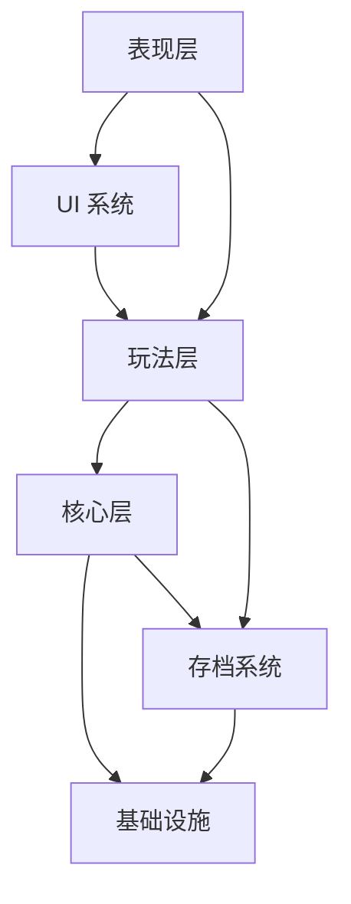
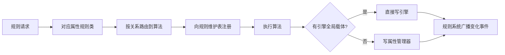

# 《规则游戏》系统模块架构

> **依据**：[规则游戏_策划案_v3.md](规则游戏_策划案_v3.md)
> **层次**：系统 / 模块级（不含具体接口签名）
> **版本**：v1.0 · 2026-10-04
> **说明**：本文取代 [Unity实现架构.md](Unity实现架构.md) 中的「总体架构」与「规则系统」两节，后者基于已被替换的集中式设计。

---

## 一、设计约束

架构必须满足的五条硬约束，均来自策划案：

| 编号 | 约束 | 出处 |
|---|---|---|
| **C1** | 规则作用于世界本身，所有实体统一受影响 | 2.3 |
| **C2** | 规则有时限，到期自动失效 | 2.4 |
| **C3** | 玩家与敌人双方都能改规则，**后写覆盖先写** | 2.6 |
| **C4** | 免疫走实体属性，**规则系统不做特例判断** | 5.4 |
| **C5** | 只持久化小数据，**绝不持久化物理状态** | 2.5 |

> C4 是最容易在实现中被无意破坏的一条。**规则系统只回答「世界现在是什么样」，不回答「谁例外」。**

---

## 二、系统清单

共 **9 个系统**，分四层：

| 层 | 系统 |
|---|---|
| **基础设施** | 时间管理器 · 快照系统 · 关卡流程 · 通用服务 |
| **核心** | 规则系统 |
| **玩法** | 玩家系统 · 敌人系统 · 战斗系统 · 场景与叙事系统 |
| **支撑** | 存档系统 · UI 系统 · 表现层 |

### 依赖方向



**铁律**：依赖单向，下层不认识上层。

| 禁止 | 原因 |
|---|---|
| 规则系统认识「玩家」「敌人」等具体实体 | 破坏 C4，规则系统会退化成巨大的 switch |
| 基础设施直接调用玩法系统 | 基础设施是所有人依赖的叶子，必须零依赖 |
| 战斗系统反向修改规则 | 战斗住在规则系统**下游**，只读取不写入 |

---

## 三、基础设施层

### 3.1 时间管理器

**全局唯一的时间权威。**

| 模块 | 职责 |
|---|---|
| **时间来源合成** | 汇总多个来源（暂停 / 时间增强 / 时间削弱 / 时间恒定），合成为一个最终倍率 |
| **输出分发** | 写回 `Time.timeScale`；维护「时间机制开关」供冷却/Buff 读取 |
| **暂停控制** | 提供暂停入口，供拼装界面调用 |

**设计要点**：

- 动画（Animator `Normal` 模式）与粒子（`useUnscaledTime = false`）**默认跟随 `Time.timeScale`**，无需手动分发。
- UI 使用 `unscaledDeltaTime`，不受时间倍率影响。
- 时间管理器**只负责速率与开关**，不负责恒定/反转的行为逻辑（那是规则系统的事）。

### 3.2 快照系统

**为「时间恒定」「时间反转」「重开关卡」提供统一的世界状态保存/恢复能力。**

| 模块 | 职责 |
|---|---|
| **快照采集** | 遍历对象注册表，记录所有动态实体的位置/速度/状态、规则表、能量、对象存活情况 |
| **快照恢复** | 将快照内容写回，使世界回到该时刻 |
| **快照存储** | 单点快照（恒定用）/ 环形缓冲（反转用） |
| **对象生命周期管理** | **对象一律「禁用」而非销毁**，保证快照恢复时能复活 |

**三种使用场景**：

| 使用方 | 快照策略 |
|---|---|
| 关卡流程（重开关卡） | 关卡开始时拍一张，重开 = 恢复它 |
| 时间恒定 | 规则生效瞬间拍**一张**，窗口内可反复恢复 |
| 时间反转 | **周期性**拍，环形缓冲保留多张，恢复时丢弃更新的快照 |

> ⚠️ **「禁用而非销毁」** 反转的滚动快照跨越较长时间，期间被打死的敌人、被捡走的道具都必须能恢复。这条如果后期才改，所有销毁代码都要返工。

### 3.3 关卡流程

**纯状态机 + 事件，零依赖。**

| 模块 | 职责 |
|---|---|
| **进度状态** | 维护当前关卡号、通关标记、失败状态 |
| **事件发布** | 发布 `OnLevelStart` / `OnLevelComplete` / `OnLevelFailed` / `OnRestartRequested` |
| **事件订阅** | 订阅「玩家到达终点」等由场景抛出的信号 |

**约束**：**不直接调用场景系统、不直接调用存档系统**。所有跨系统协作走事件总线。

> 这样改造后它只依赖事件总线，符合基础设施的零依赖要求，而且**可以脱离 Unity 单独测试**。

### 3.4 通用服务

| 模块 | 职责 |
|---|---|
| **事件总线** | 系统间解耦通信。所有订阅必须配对取消 |
| **对象注册表** | 登记所有「受规则影响的动态实体」，供摩擦/质量遍历与快照采集使用。**不要每帧 `FindObjectsOfType`** |

---

## 四、核心层：规则系统

**整个项目的核心。** 采用「每属性一个规则类 + 中央事实来源」的结构。

### 4.1 结构

```
RuleSystem
  ├── 规则维护表          ← 7 个属性槽位
  ├── 属性管理器          ← 属性当前值（事实来源）
  ├── 重力规则类
  ├── 时间规则类          ← 含时间恒定 / 时间反转的行为
  ├── 摩擦规则类
  ├── 质量规则类
  ├── 关系规则类
  ├── 伤害/生命规则类
  └── 因果规则类
```

### 4.2 模块职责

| 模块 | 职责 |
|---|---|
| **规则维护表** | 记录每个属性**当前生效的规则**、剩余时间、来源。**每属性一个槽位** |
| **属性管理器** | 保存各属性的当前值，作为**外部事实来源**供其他系统查询 |
| **属性规则类**（×7） | 接收本属性的规则请求 → 按关系路由到算法 → 注册规则表 → 执行 → 改值 → 广播 |
| **规则定义** | ScriptableObject，规则的静态定义（名称、时长、消耗、说明） |

### 4.3 每属性一个槽位

策划案 B3 定了「**属性词条每种只有一个**」，加上「单一规则表、后写覆盖先写」——
因此**每个属性同时最多只有一条规则生效**。

| 槽位 | 内容 |
|---|---|
| 属性 | 重力 / 时间 / 摩擦 / 质量 / 关系 / 伤害生命 / 因果 |
| 当前规则 | 该属性正在生效的关系（反转/失效/恒定/增强/削弱） |
| 剩余时间 | 该规则的剩余生效时间 |
| 来源 | 玩家 / 敌人 / 关卡脚本（**仅用于视觉提示，不参与优先级**） |

> ⚠️ **`来源` 字段绝不参与「谁优先级高」的判断** —— 那就是双规则表模型了，违背 C3。

### 4.4 规则生效流程



### 4.5 属性管理器 vs 直接写引擎

**判据：有引擎全局载体的直接写引擎，没有的进属性管理器。**

| 属性 | 载体 |
|---|---|
| 重力 | `Physics2D.gravity`（引擎有全局值） |
| 时间速率 | `Time.timeScale`（引擎有全局值） |
| 时间机制开关 | 属性管理器 |
| 摩擦 | 属性管理器（需遍历碰撞体，无全局值） |
| 质量 | 属性管理器（需遍历刚体，无全局值） |
| 伤害 / 生命 | 属性管理器 |
| 关系 | 属性管理器（阵营表） |
| 因果 | 属性管理器 |

> **代价**：查询路径不统一。若要求统一查询，可让属性管理器也保存一份重力/时间的**意图值**（与引擎值同步）。当前设计选择不冗余。

### 4.6 两类规则

| 类型 | 特征 | 规则 |
|---|---|---|
| **参数型** | 改世界的某个参数，投射一次即可 | 重力、摩擦、质量、时间增强/削弱、伤害增减 |
| **行为型** | 提供持续能力，需要输入 + 计时 + 状态 | **时间恒定、时间反转**、时间失效 |

行为型规则由对应的属性规则类内部实现，各自维护计时器与输入。

### 4.7 广播

**广播是规则系统的职责，不是属性管理器的职责。**

原因：部分属性（重力、时间速率）不经过属性管理器，若由它广播则通知路径不一致。
统一由规则系统广播变化事件（携带属性 id），保证所有属性的通知路径一致。

### 4.8 计时器

**统一使用 `Time.deltaTime`。**

| 好处 | 说明 |
|---|---|
| 暂停自动冻结 | 暂停时 `Time.timeScale = 0`，计时器自动停止，无需每个规则类判断暂停 |
| 语义自洽 | 时间减缓时规则时限同步延长——「时间变慢，规则也变慢」 |

### 4.9 规则时限分档

| 档位 | 属性 | 时长 |
|---|---|---|
| 永久（关卡内） | 摩擦、质量 | ∞ |
| 长时限 | 重力 | 30-60 秒 |
| 短时限 | 时间、伤害/生命、因果 | 5-15 秒 |

> 规则失效时**必须有过渡**（重力用 0.3-0.5 秒插值恢复），不能瞬间跳变。

### 4.10 时间恒定与时间反转

两者共用快照系统，但策略不同：

| | 时间恒定 | 时间反转 |
|---|---|---|
| 快照时机 | 规则生效瞬间拍一张 | 周期性拍，环形缓冲 |
| 回溯目标 | 固定那一个点 | 可选历史点（只读倒数第二张） |
| 限制 | **时间**（5 秒窗口） | **能量** |
| 次数 | 窗口内无限 | 受能量限制 |
| 输入 | **独占一个键** | 走规则释放通道 |

**数值错开避免冲突**：恒定持续 5 秒；反转快照间隔 5 秒且只读倒数第二张，回溯范围为 5-10 秒，正好覆盖恒定的持续窗口。

---

## 五、玩法层

### 5.1 玩家系统

| 模块 | 职责 |
|---|---|
| **玩家状态** | 玩家专有状态：生命、朝向等。**含玩家能量** |
| **移动控制** | Kinematic Rigidbody2D 控制；**自己读取重力/摩擦并应用**（Kinematic 刚体不吃引擎自动重力与材质摩擦） |
| **玩家战斗** | 近战攻击、踩踏 |
| **规则释放入口** | 拼装界面调用入口。**能量检查与扣除在此完成** |

**关于能量消耗的位置**：规则生效的发出点是玩家控制器 / UI，因此**能量消耗逻辑写在这里**，而不是规则系统内部。

> 这样规则系统不需要认识能量，避免循环依赖（玩家读属性管理器 → 玩家依赖规则系统；若规则系统再依赖玩家能量 → 循环）。

### 5.2 敌人系统

| 模块 | 职责 |
|---|---|
| **敌人状态** | 生命、阵营、**含敌人能量** |
| **敌人 AI** | 巡逻 / 追击 / 攻击状态机；**改规则行为**（消耗自身能量） |
| **敌人战斗** | 攻击、受击 |

**约束**：

- **敌人必须走与玩家同一套属性查询** —— 做到这点，「重力反转后敌人也飘」自动生效，无需额外代码。
- **免疫通过实体属性体现**，不在规则系统里加特例。例：盘踞者是「抓紧了地面」所以重力效果大减，而不是「重力规则对它无效」。

### 5.3 战斗系统

| 模块 | 职责 |
|---|---|
| **伤害结算** | 读取属性管理器的伤害参数 + 目标自身抗性，计算最终伤害。**对玩家与敌人使用同一函数** |
| **命中判定** | 攻击范围、碰撞检测 |

**约束**：战斗系统住在规则系统**下游**，只读取不写入。

### 5.4 场景与叙事系统

| 模块 | 职责 |
|---|---|
| **关卡加载切换** | 场景加载、卸载、转场表现 |
| **受规则影响物件** | 可动场景物品（石头、门等），注册到对象注册表，走统一属性查询 |
| **场景触发器** | 终点判定、区域触发、教学触发 |
| **NPC 台词** | 状态驱动台词；数据外置为 CSV/JSON |

**NPC 台词的数据来源**（不设中间层，直接读）：

| 需要什么 | 从哪读 |
|---|---|
| 当前世界状态 | **规则维护表**（如「重力是否反转」） |
| 场景物件状态 | **物件自身**（如「NPC 的房子是否变了」） |
| 曾经发生过什么 | **存档系统的规则历史** |

**NPC 台词的技术约束**：

- 规模：**20-40 条 barks**（参照 Exocolonist 是 1800 条 + 60 万字，21 天必须大幅缩减）
- **条件必须绑定「当前状态」，不能绑定历史事件** —— 否则会出现「第 5 关 NPC 提到第 6 关才开的规则」的时序穿帮。历史只用于**回顾式**台词（「刚才我怎么突然飞起来了」），不用于**预测式**台词
- 三层防御：外置数据表 → 启动期引用校验 → **无条件兜底 bark**
- 工具：**不自研对话引擎**，用 Yarn Spinner 或 CSV + 条件求值

---

## 六、支撑层

### 6.1 存档系统

| 模块 | 职责 |
|---|---|
| **进度数据** | 已解锁词条、当前关卡、通关标记、能量 |
| **规则历史** | 激活历史记录，供 NPC 台词引用 |
| **读写** | 序列化与反序列化 |

**铁律**：**绝不序列化任何 Transform / Rigidbody / 物理状态。**

重开关卡的流程是：加载关卡场景（世界回到设计初态）→ 读存档中的规则 → 重新应用。
这样永远不会有「存档被玩坏」的问题。

### 6.2 UI 系统

| 模块 | 职责 | 优先级 |
|---|---|---|
| **HUD** | 生命、能量、**当前生效规则（常驻显示）**、规则剩余时间 | 必须 |
| **拼装界面** | 属性 + 关系选择、效果预览、能量消耗、**可组合规则数** | 必须 |
| **教学提示** | 关卡内引导（轻量，以关卡设计为主） | 建议 |
| **结算画面** | 元叙事落点：改了多少条规则、世界变成什么样 | 建议 |
| **设置菜单** | 音量、显示、按键说明 | P2 |

> **「当前生效规则」的常驻显示最容易被忽略但最重要** —— 规则跨关卡保留，玩家自己会忘，忘了就会把异常归因于游戏 bug。

### 6.3 表现层

| 模块 | 职责 |
|---|---|
| **摄像机** | 跟随、规则生效时的特写（Cinemachine） |
| **VFX** | 规则生效的全屏特效、粒子 |
| **音频** | 音效、音乐 |

**规则生效的反馈**：特写 + 全屏特效，时长 0.5-1 秒，**特写期间世界静止**。

> 额外收益：官方要求提交素材**不能用过场动画**，而「规则生效特写」属于游戏内实时画面，可作首选素材。

---

## 七、模块总表

| 系统 | 模块 | 关键职责 |
|---|---|---|
| **时间管理器** | 时间来源合成 | 暂停 / 增强 / 削弱 / 恒定 → 单一倍率 |
| | 输出分发 | 写 `Time.timeScale` + 时间机制开关 |
| **快照系统** | 快照采集 | 遍历注册表记录世界状态 |
| | 快照恢复 | 写回世界状态 |
| | 快照存储 | 单点 / 环形缓冲 |
| | 生命周期管理 | 禁用而非销毁 |
| **关卡流程** | 进度状态 | 当前关卡、通关标记 |
| | 事件发布订阅 | 纯事件协作，零依赖 |
| **通用服务** | 事件总线 | 系统间解耦 |
| | 对象注册表 | 受规则影响实体的登记表 |
| **规则系统** | 规则维护表 | 7 个属性槽位 |
| | 属性管理器 | 属性当前值（事实来源） |
| | 属性规则类 ×7 | 路由、注册、执行、计时、输入 |
| | 规则定义(SO) | 静态数据 |
| **玩家系统** | 玩家状态（含能量） | 生命、朝向、能量 |
| | 移动控制 | Kinematic 控制 + 自读属性 |
| | 玩家战斗 | 攻击、踩踏 |
| | 规则释放入口 | 能量检查与扣除 |
| **敌人系统** | 敌人状态（含能量） | 生命、阵营、能量 |
| | 敌人 AI | 状态机 + 改规则行为 |
| | 敌人战斗 | 攻击、受击 |
| **战斗系统** | 伤害结算 | 统一伤害计算 |
| | 命中判定 | 范围与碰撞 |
| **场景与叙事** | 关卡加载切换 | 场景生命周期 |
| | 受规则影响物件 | 可动物件 |
| | 场景触发器 | 终点、区域、教学 |
| | NPC 台词 | 状态驱动台词（直读规则表 / 物件 / 历史） |
| **存档系统** | 进度数据 | 解锁、关卡、能量 |
| | 规则历史 | 激活历史 |
| | 读写 | 序列化 |
| **UI 系统** | HUD | 常驻状态显示 |
| | 拼装界面 | 核心交互 |
| | 教学提示 / 结算 / 设置 | 辅助 |
| **表现层** | 摄像机 / VFX / 音频 | 表现 |

---

## 八、关键设计决策记录

| 编号 | 决策 | 说明 |
|---|---|---|
| **D1** | 玩家控制器 = **Kinematic Rigidbody2D** | 手感可控；需自己读取重力并模拟摩擦 |
| **D2** | 砍掉**空间**属性 | 六个格位技术形态不一致，「穿墙」破坏所有关卡边界 |
| **D3** | 砍掉**方向**属性 | 改变的是玩家的输入映射而非世界法则，与核心理念冲突 |
| **D4** | 砍掉**循环**关系 | 一次性消掉 9 个格位，解决时间循环与因果循环两个高风险项 |
| **D5** | 规则维度 = **7 属性 × 5 关系 = 35 格** | 见 [规则矩阵.json](规则矩阵.json) |
| **D6** | **单一规则表**，后写覆盖先写 | 玩家与敌人写同一张表 |
| **D7** | **每属性一个槽位** | 因属性词条每种只有一个 |
| **D8** | **能量是实体状态**的一部分 | 玩家与敌人各一套，不设通用组件层 |
| **D9** | **能量消耗逻辑在规则发出点** | 玩家控制器 / UI，不在规则系统内 |
| **D10** | **规则按属性分模块** | 每属性一个规则类；算法不收归集中 |
| **D11** | **广播由规则系统统一发** | 不归属性管理器 |
| **D12** | **计时器统一用 `Time.deltaTime`** | 暂停自动冻结 |
| **D13** | **有引擎全局载体的直接写引擎** | 重力、时间速率；其余进属性管理器 |
| **D14** | **时间恒定与反转共用快照系统** | 恒定单点快照 / 反转滚动快照 |
| **D15** | **对象禁用而非销毁** | 保证快照恢复能复活对象 |
| **D16** | 时间恒定**独占一个键**，反转走规则释放通道 | 两者数值错开避免冲突 |

---

## 九、下一步

本文定到系统 / 模块级。下一层需要拆的是**接口**，建议顺序：

| 顺序 | 内容 | 为什么先做 |
|---|---|---|
| 1 | **规则维护表 + 属性管理器** | 所有属性规则类都要和它们打交道，定死后可并行开发 |
| 2 | **属性规则类基类** | 7 个属性类共享的接口，定死后 7 个人可以各写一个 |
| 3 | **快照系统接口** | 恒定、反转、重开关卡三方共用 |
| 4 | **时间管理器接口** | 所有玩法代码都要读时间 |
| 5 | 其余系统 | 依赖前四项 |

> **12 人团队最需要的不是更多人写代码，而是更早定死接口。**

---

## 附录 · 相关文档

| 文档 | 内容 |
|---|---|
| [规则游戏_策划案_v3.md](规则游戏_策划案_v3.md) | 正式策划案 |
| [规则矩阵.json](规则矩阵.json) | 35 个规则格位 + 未定稿清单 |
| [评审与修改建议.md](评审与修改建议.md) | 外部评审与调研 |
| [Unity实现架构.md](Unity实现架构.md) | Unity 具体实现细节（部分已被本文取代） |

*本文为系统模块级架构，不含接口签名。接口设计见后续文档。*